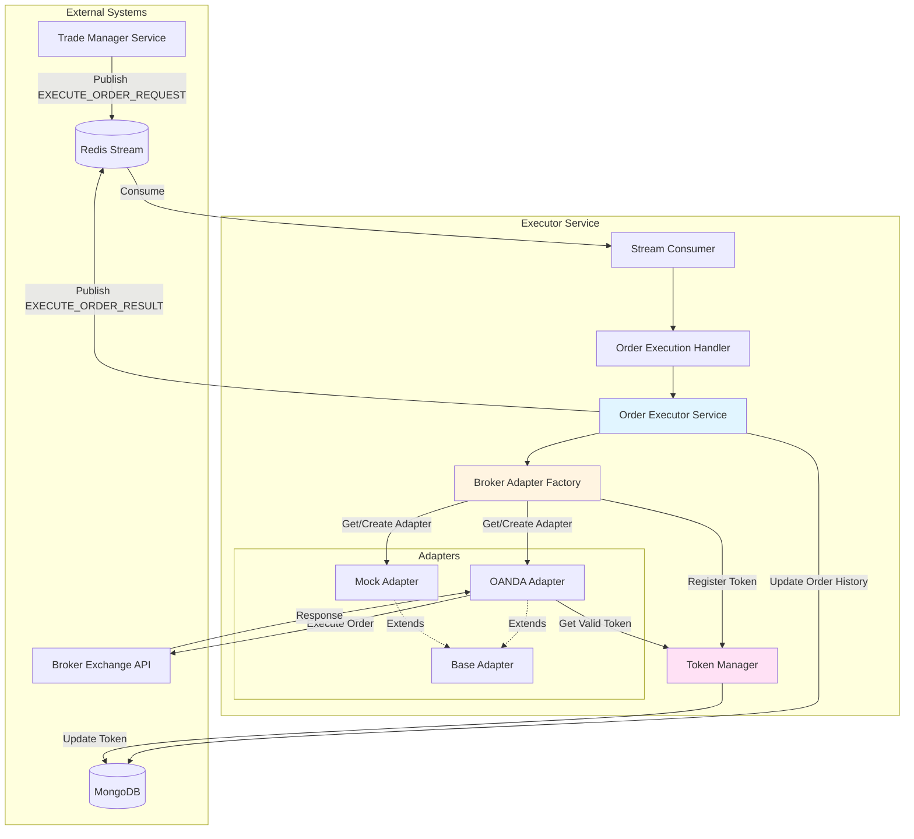
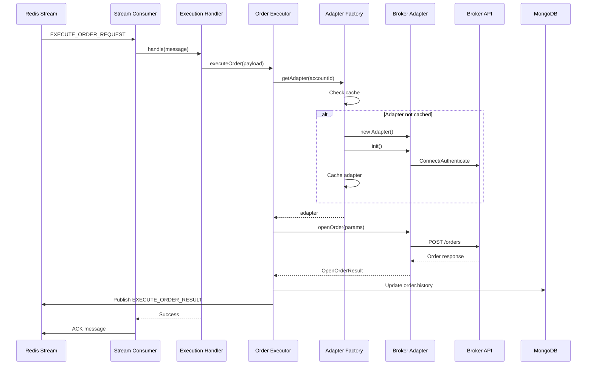

# Executor Service

**Purpose**: Execute trading orders on broker exchanges via broker adapters, consuming order execution requests from Redis streams and publishing results.

## Table of Contents

- [Purpose and Responsibilities](#purpose-and-responsibilities)
- [Architecture Overview](#architecture-overview)
- [Broker Adapter Pattern](#broker-adapter-pattern)
- [Configuration Guide](#configuration-guide)
- [Development Setup](#development-setup)
- [Testing Guide](#testing-guide)

---

## Purpose and Responsibilities

The `executor-service` is responsible for:

1. **Order Execution**: Execute trading orders (LONG, SHORT, CLOSE, CANCEL, MOVE_SL, SET_TP_SL) via broker adapters
2. **Stream Processing**: Consume `EXECUTE_ORDER_REQUEST` messages from Redis streams
3. **Result Publishing**: Publish `EXECUTE_ORDER_RESULT` messages back to streams
4. **Broker Abstraction**: Provide a unified interface for multiple broker exchanges via the adapter pattern
5. **Token Management**: Handle authentication token refresh with race condition protection
6. **Order History Tracking**: Maintain execution history in the database for audit and debugging

### Key Features

- **Multi-Broker Support**: Pluggable adapter architecture for different exchanges (OANDA, Mock, etc.)
- **Token Refresh**: Automatic JWT token refresh with in-memory caching and race condition handling
- **Error Handling**: Comprehensive error classification and Sentry integration
- **Graceful Shutdown**: Proper cleanup of adapters, streams, and database connections
- **Pre-loading**: Adapter pre-loading on startup to eliminate first-order latency
- **Live Price Streaming**: Real-time price updates via OANDA streaming API, replacing periodic polling for sub-second latency

---

## Price Streaming

The `executor-service` includes built-in support for live price streaming, currently implemented for OANDA. This significantly reduces price latency (from 10-20 seconds to sub-second updates) and ensures the most accurate pricing is always available in the `PriceCacheService`.

### OANDA Price Streaming Job

The `OandaPriceStreamingJob` is a persistent job that manages a live connection to OANDA's pricing stream.

#### Features
- **Real-time Updates**: Prices are updated in Redis as soon as they are received from OANDA.
- **Symbol Mapping**: Transparent bidirectional mapping between universal symbols (e.g., `XAUUSD`) and OANDA format (`XAU_USD`).
- **Resilience**: Automatic reconnection with exponential backoff (1s, 2s, 4s, 8s, up to 30s).
- **Graceful Shutdown**: Properly closes the persistent stream connection on job stop.

#### Configuration
The job is configured via the `executorServiceJob` collection in the database.

```json
{
  "name": "OANDA Price Streaming",
  "type": "oanda-price-streaming-job",
  "status": "active",
  "config": {
    "//": "cronExpression is removed manually on init since this is a persistent stream"
  },
  "meta": {
    "symbols": ["XAUUSD", "EURUSD", "GBPUSD"]
  }
}
```

#### Reconnection Logic
If the stream connection is lost:
1. The job logs an error and captures it to Sentry.
2. It waits for a delay based on consecutive failures (Exponential Backoff).
3. It attempts to restart the stream.
4. After 5 consecutive failures without a successful connection, it stops attempting to reconnect and logs a critical error.

### Polling vs. Streaming
Traditional polling (fetching price every X seconds) is easier to implement but introduces significant latency and high API overhead. Streaming provides real-time data with a single persistent connection, making it ideal for high-frequency trading applications.

---


## Architecture Overview

### High-Level Flow



### Component Responsibilities

| Component                   | Responsibility                                                                           |
| --------------------------- | ---------------------------------------------------------------------------------------- |
| **Stream Consumer**         | Consume messages from `ORDER_EXECUTION_REQUESTS` stream                                  |
| **Order Execution Handler** | Validate and route messages to Order Executor Service                                    |
| **Order Executor Service**  | Core business logic for order execution, routing commands to appropriate adapter methods |
| **Broker Adapter Factory**  | Create, cache, and manage broker adapter instances per account                           |
| **Token Manager**           | Manage authentication tokens with refresh logic and race condition protection            |
| **Broker Adapters**         | Exchange-specific implementations for order execution (OANDA, Mock, etc.)                |

### Processing Flow



---

## Broker Adapter Pattern

### Interface Design

All broker adapters implement the `IBrokerAdapter` interface, providing a unified contract for order execution:

```typescript
interface IBrokerAdapter {
  // Lifecycle
  init(): Promise<void>;
  close(): Promise<void>;
  ready(): boolean;

  // Token management
  getTokenKey(): string;

  // Order execution
  openOrder(params: OpenOrderParams): Promise<OpenOrderResult>;
  closeOrder(params: CloseOrderParams): Promise<CloseOrderResult>;
  cancelOrder(params: CancelOrderParams): Promise<void>;
  updateStopLoss(params: UpdateStopLossParams): Promise<UpdateStopLossResult>;
  updateTakeProfit(params: UpdateTakeProfitParams): Promise<UpdateTakeProfitResult>;

  // Market data
  fetchPrice(symbol: string): Promise<PriceTicker>;
  getAccountInfo(): Promise<AccountInfo>;
  fetchPositions(symbol: string): Promise<ExchangePosition[]>;
  fetchOpenOrders(symbol: string): Promise<ExchangeOrder[]>;

  // Metadata
  getName(): string;
  getExchangeCode(): string;
}
```

### Command Mapping

| Command                            | Adapter Method                            | Description                           |
| ---------------------------------- | ----------------------------------------- | ------------------------------------- |
| `LONG` / `SHORT`                   | `openOrder()`                             | Open new position (market or limit)   |
| `CLOSE_ALL` / `CLOSE_BAD_POSITION` | `closeOrder()`                            | Close existing open position          |
| `CANCEL`                           | `cancelOrder()`                           | Cancel pending order (not yet filled) |
| `MOVE_SL`                          | `updateStopLoss()`                        | Update stop loss price                |
| `SET_TP_SL`                        | `updateStopLoss()` + `updateTakeProfit()` | Update both TP and SL                 |

### Base Adapter

The `BaseBrokerAdapter` abstract class provides:

- **Retry Logic**: Exponential backoff for transient errors
- **Lifecycle Management**: Common `ready()` state tracking
- **Abstract Methods**: Force implementation of exchange-specific logic

### Adapter Factory

The `BrokerAdapterFactory`:

1. **Caches** adapter instances per `accountId` (one adapter per account)
2. **Pre-loads** all active account adapters on startup
3. **Registers** tokens with `TokenManager` during adapter initialization
4. **Manages** adapter lifecycle (init, close)

### Token Management

The `TokenManager` handles:

- **In-Memory Storage**: Token metadata with expiry tracking
- **Race Condition Protection**: Shared refresh promises for concurrent requests
- **Automatic Refresh**: JWT token refresh before expiry
- **Database Persistence**: Update `Account.brokerConfig` after successful refresh

**Token Key Strategy**:
- **XM**: All accounts with same JWT share tokens → key by JWT hash
- **Exness**: Each account has unique tokens → key by accountId
- **API Key brokers** (OANDA): No token refresh needed → static key

---

## Configuration Guide

### Environment Variables

Create a `.env` file based on `.env.sample`:

```bash
# Application Configuration
APP_NAME=executor-service
LOG_LEVEL=info
NODE_ENV=development

# MongoDB Configuration
MONGODB_URI=mongodb://localhost:27017/?replicaSet=rs0
MONGODB_DBNAME=telegram-trading-bot-mini

# Redis Stream Configuration
REDIS_URL=redis://localhost:6379

# Stream Consumer Mode
# Options: NEW (process only new messages), ALL (process from beginning)
STREAM_CONSUMER_MODE_ORDER_EXECUTION_REQUESTS=NEW

# Price Feed Configuration (for future price feed jobs)
PRICE_FEED_INTERVAL_MS=5000
PRICE_FEED_BATCH_SIZE=10

# Order Execution Configuration
ORDER_EXECUTION_TIMEOUT_MS=30000
ORDER_RETRY_MAX_ATTEMPTS=3

# Sentry Configuration
SENTRY_DSN=https://your-sentry-dsn-here
```

### Configuration Parameters

| Parameter                                       | Type   | Default                                     | Description                                 |
| ----------------------------------------------- | ------ | ------------------------------------------- | ------------------------------------------- |
| `APP_NAME`                                      | string | `executor-service`                          | Service name for logging and consumer group |
| `LOG_LEVEL`                                     | string | `info`                                      | Logging level (debug, info, warn, error)    |
| `NODE_ENV`                                      | string | `development`                               | Environment (development, production)       |
| `MONGODB_URI`                                   | string | `mongodb://localhost:27017/?replicaSet=rs0` | MongoDB connection string                   |
| `MONGODB_DBNAME`                                | string | `telegram-trading-bot-mini`                 | Database name                               |
| `REDIS_URL`                                     | string | `redis://localhost:6379`                    | Redis connection URL                        |
| `STREAM_CONSUMER_MODE_ORDER_EXECUTION_REQUESTS` | enum   | `NEW`                                       | Stream consumer mode (NEW, ALL)             |
| `PRICE_FEED_INTERVAL_MS`                        | number | `5000`                                      | Price feed polling interval (future use)    |
| `PRICE_FEED_BATCH_SIZE`                         | number | `10`                                        | Price feed batch size (future use)          |
| `ORDER_EXECUTION_TIMEOUT_MS`                    | number | `30000`                                     | Order execution timeout                     |
| `ORDER_RETRY_MAX_ATTEMPTS`                      | number | `3`                                         | Max retry attempts for failed orders        |
| `SENTRY_DSN`                                    | string | -                                           | Sentry DSN for error tracking               |

### Stream Consumer Modes

- **`NEW`**: Process only new messages (default for production)
  - Starts from `$` (latest message)
  - Ignores historical messages
  - Recommended for production to avoid reprocessing

- **`ALL`**: Process all messages from the beginning
  - Starts from `0` (first message)
  - Processes entire stream history
  - Useful for development and debugging

---

## Development Setup

### Prerequisites

- Node.js 18+
- MongoDB (with replica set enabled)
- Redis

### Installation

```bash
# Install dependencies
npm install

# Start MongoDB with replica set
docker run -d -p 27017:27017 --name mongo mongo --replSet rs0
docker exec -it mongo mongosh --eval "rs.initiate()"

# Start Redis
docker run -d -p 6379:6379 --name redis redis

# Copy environment file
cp .env.sample .env

# Update .env with your configuration
```

### Running the Service

```bash
# Development mode (with auto-reload)
npx nx serve executor-service

# Production build
npx nx build executor-service

# Run production build
node dist/apps/executor-service/main.js
```

### Adapter Verifier Script

Test broker adapters in isolation without running the full service:

```bash
# Run adapter verifier
npx nx adapter-verifier executor-service
```

See [`src/scripts/adapter-verifier/README.md`](./src/scripts/adapter-verifier/README.md) for detailed usage instructions.

---

## Testing Guide

### Test Structure

```
test/
├── integration/          # Integration tests
│   └── setup.ts         # Jest global setup
├── unit/                # Unit tests
│   ├── adapters/        # Adapter tests
│   │   ├── base.adapter.spec.ts
│   │   ├── factory.spec.ts
│   │   └── mock/
│   │       └── mock.adapter.spec.ts
│   └── config.spec.ts   # Config tests
└── utils/               # Test utilities
```

### Running Tests

```bash
# Run all tests
npx nx test executor-service

# Run unit tests only
npx nx test executor-service --testPathPattern=unit

# Run integration tests only
npx nx test executor-service --testPathPattern=integration

# Run with coverage
npx nx test executor-service --coverage

# Watch mode
npx nx test executor-service --watch
```

### Test Categories

#### Unit Tests

Focus on isolated component logic:

- **Adapter Tests**: Mock external API calls, test adapter logic
- **Factory Tests**: Test adapter caching and lifecycle
- **Config Tests**: Validate configuration loading

#### Integration Tests

Test full flows with real dependencies:

- **Order Execution Flow**: End-to-end order execution with mock adapter
- **Stream Processing**: Redis stream consumption and message handling
- **Database Persistence**: Order history updates

### Adapter Verifier for Manual Testing

For testing new broker adapters with real exchange APIs:

1. Update `src/scripts/adapter-verifier/seed-account.json` with broker credentials
2. Update `src/scripts/adapter-verifier/test-cases.ts` with current market prices
3. Run: `npx nx adapter-verifier executor-service`

See the [Adapter Verifier README](./src/scripts/adapter-verifier/README.md) for details.

---

## Error Handling

### Error Classification

The `OrderExecutorService` classifies errors into categories:

- **`BROKER_ERROR`**: Exchange API errors (rate limits, invalid orders)
- **`NETWORK_ERROR`**: Connection timeouts, network failures
- **`VALIDATION_ERROR`**: Invalid parameters or configuration
- **`UNKNOWN_ERROR`**: Unclassified errors

### Error Capture

All errors are captured by Sentry with:

- **Context**: Order ID, account ID, command, trace token
- **Classification**: Error type for better filtering
- **Stack Trace**: Full error details

### Graceful Shutdown

The service handles shutdown signals (`SIGTERM`, `SIGINT`) gracefully:

1. Stop stream consumers
2. Close all broker adapters
3. Close stream publisher
4. Close database connection

---

## Monitoring and Observability

### Logging

Structured logging with Pino:

```typescript
logger.info({
  orderId: '...',
  accountId: '...',
  command: 'LONG',
  traceToken: '...'
}, 'Order execution started');
```

### Sentry Integration

- **Error Tracking**: All errors captured with context
- **Performance Monitoring**: Transaction tracing (50% sampling in production)
- **Log Integration**: Pino logs sent to Sentry

### Metrics (Future)

- Order execution latency
- Adapter cache hit rate
- Token refresh frequency
- Stream consumer lag

---

## Future Enhancements

- [ ] **Price Feed Jobs**: Periodic price updates for all active symbols
- [ ] **Multi-Instance Support**: Distributed token management with Redis
- [ ] **Adapter Health Checks**: Periodic adapter connectivity checks
- [ ] **Order Retry Queue**: Separate queue for failed orders with exponential backoff
- [ ] **Real-Time Notifications**: Push notifications for order execution status
- [ ] **Additional Brokers**: Binance, XM, Exness adapters

---

## Related Documentation

- [Adapter Verifier README](./src/scripts/adapter-verifier/README.md) - Manual testing tool for broker adapters
- [Test Plan](./TEST_PLAN.md) - Comprehensive test generation plan
- [OpenSpec Change](../../openspec/changes/build-executor-service/) - Full feature specification
