# System Architecture

## Overview
The Telegram Auto-Trading Bot is a distributed, event-driven system that automatically executes trades based on signals from Telegram channels. The architecture follows a microservices pattern with clear separation of concerns and asynchronous communication via Redis Streams.

---

## High-Level Architecture

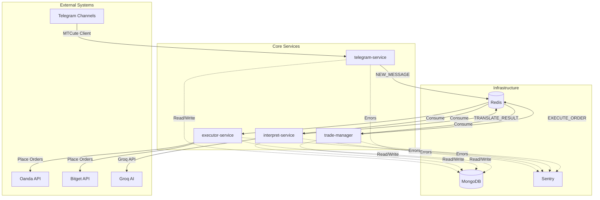

---

## Service Responsibilities

### 1. **telegram-service**
**Purpose**: Monitor Telegram channels and publish new messages to the event stream.

**Key Responsibilities**:
- Connect to Telegram using MTCute client
- Listen for new messages in configured channels
- Store raw messages in `telegram-messages` collection
- Publish `NEW_MESSAGE` events to Redis Stream

**Technology Stack**:
- MTCute (Telegram client)
- MongoDB (message storage)
- Redis Streams (event publishing)

---

### 2. **interpret-service**
**Purpose**: Translate human-language trading signals into structured commands using AI.

**Key Responsibilities**:
- Consume `NEW_MESSAGE` events from Redis Stream
- Load prompt rules from `prompt-rules` collection
- Send messages to Groq AI (llama-3.1-8b-instant) for interpretation
- Parse AI responses into structured trading commands
- Publish `TRANSLATE_MESSAGE_RESULT` events

**Technology Stack**:
- Groq AI API (primary)
- Google Gemini (alternative)
- In-memory prompt caching (30min TTL)

**Data Flow**:
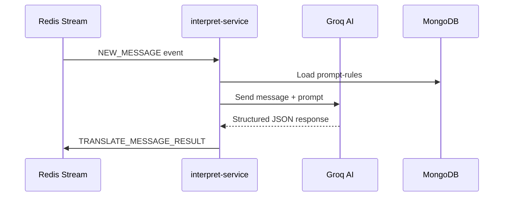

---

### 3. **trade-manager**
**Purpose**: Business logic orchestration for order management and risk validation.

**Key Responsibilities**:
- Consume `TRANSLATE_MESSAGE_RESULT` events
- Validate commands against account configurations
- Handle message edits (close/recreate orders)
- Create order records in `orders` collection
- Calculate lot sizes based on risk percentage
- Publish `EXECUTE_ORDER_REQUEST` events

**Key Components**:
- **TranslateResultHandler**: Main event consumer
- **CommandTransformerService**: Transform AI commands to execution payloads
- **MessageEditHandlerService**: Detect and handle message edits
- **OrderService**: CRUD operations for orders

**Business Rules**:
- Respect `maxOpenPositions` per account
- Enforce `operationHours` (e.g., "Sun-Fri: 18:05 - 16:59")
- Apply `stopLossAdjustPricePercentage` buffer
- Link orders via `isLinkedWithPrevious` flag (DCA strategy)

**Linked Orders (DCA Strategy)**:

For channels using Dollar Cost Averaging (DCA) strategies (e.g., Hang Moon), the system supports **automatic order linking**:

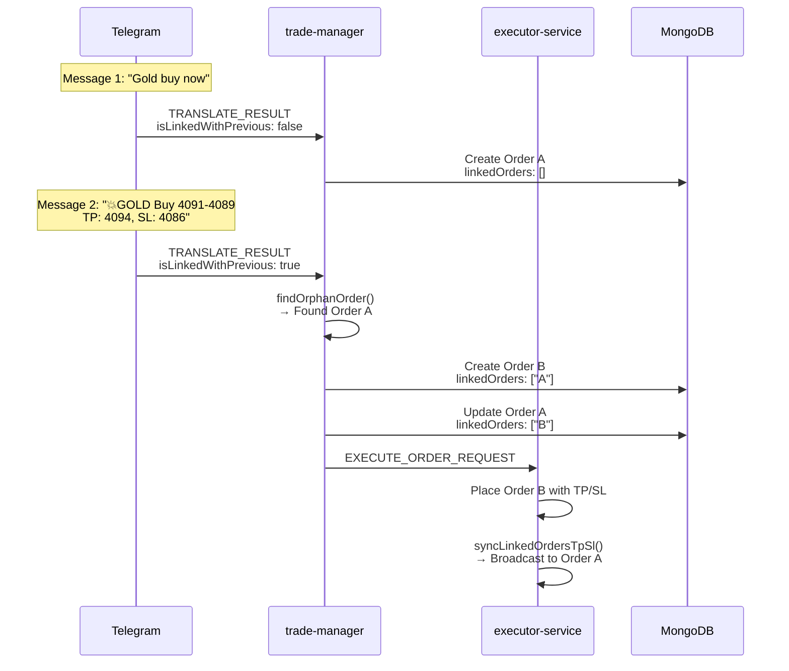

**How It Works**:
1. **First Message** ("Gold buy now"): Creates **orphan order** (no TP/SL, `linkedOrders: []`)
2. **Second Message** ("💥GOLD Buy..."): AI sets `isLinkedWithPrevious: true`
3. **trade-manager**: Finds most recent orphan order for same account/channel
4. **Linking**: Creates circular relationship (`A.linkedOrders = ["B"]`, `B.linkedOrders = ["A"]`)
5. **TP/SL Sync**: executor-service broadcasts TP/SL from Order B to Order A

**Benefits**:
- ✅ Automatic DCA position management
- ✅ Unified TP/SL across related orders
- ✅ No manual intervention required
- ✅ Full audit trail in `Order.history`

**See**: [Linked Orders Documentation](./linked-orders.md) for detailed implementation

---

### 4. **executor-service**
**Purpose**: Execute trades on broker platforms and manage order lifecycle.

**Key Responsibilities**:
- Consume `EXECUTE_ORDER_REQUEST` events
- Route orders to appropriate broker adapters (Oanda, Bitget, etc.)
- Execute market/limit orders
- Set Take Profit (TP) and Stop Loss (SL)
- Update order status in database
- Run background jobs for price/balance caching

**Key Components**:
- **OrderExecutorService**: Main execution orchestrator
- **Broker Adapters**: Exchange-specific implementations
  - `OandaAdapter`: Forex/Gold trading
  - `BitgetAdapter`: Crypto futures
  - `MockAdapter`: Testing/simulation
- **Background Jobs**:
  - `FetchPriceJob`: Cache real-time prices (every 15-30s)
  - `FetchBalanceJob`: Cache account balances (every 5s)
  - `AutoUpdateOrderStatusJob`: Sync order statuses (every 30s)
  - `AutoSyncTpSlLinkedOrderJob`: Sync TP/SL across linked orders (every 1min)

**Broker Adapter Interface**:
```typescript
interface IBrokerAdapter {
  placeOrder(params: PlaceOrderParams): Promise<OrderResult>;
  cancelOrder(orderId: string): Promise<void>;
  getBalance(): Promise<BalanceSnapshot>;
  getPrice(symbol: string): Promise<PriceData>;
}
```

---

## Data Models & Relationships

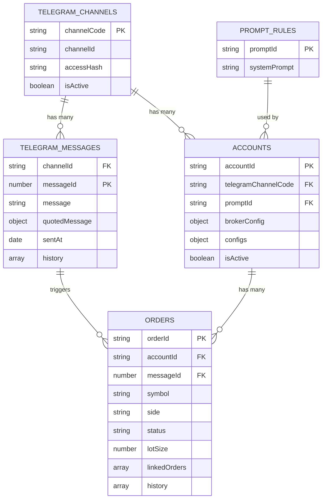

### Key Collections

#### **telegram-channels**
Stores Telegram channel metadata.
- `channelCode`: Human-readable identifier
- `channelId`: Telegram's internal ID
- `accessHash`: Authentication token

#### **telegram-messages**
Raw messages from Telegram with processing history.
- `history[]`: Audit trail of AI interpretation and execution requests

#### **accounts**
Trading account configurations.
- `brokerConfig`: Exchange-specific settings (API keys, account IDs)
- `configs`: Risk management (max risk %, max positions, operation hours)
- `symbols`: Per-symbol overrides (e.g., entry zone delta)

#### **orders**
Order lifecycle tracking.
- `status`: `pending` → `open` → `closed`
- `linkedOrders[]`: References to related orders (DCA, TP/SL)
- `history[]`: Execution events (placed, filled, cancelled)

#### **prompt-rules**
AI system prompts for signal interpretation.
- `systemPrompt`: Full prompt text with examples and rules

---

## Design Pattern: Distributed Saga with Event Sourcing Audit Trail

The system implements a **Distributed Saga Pattern** with **Event Sourcing** for audit trails, enabling reliable multi-step order processing across distributed services.

### Pattern Overview

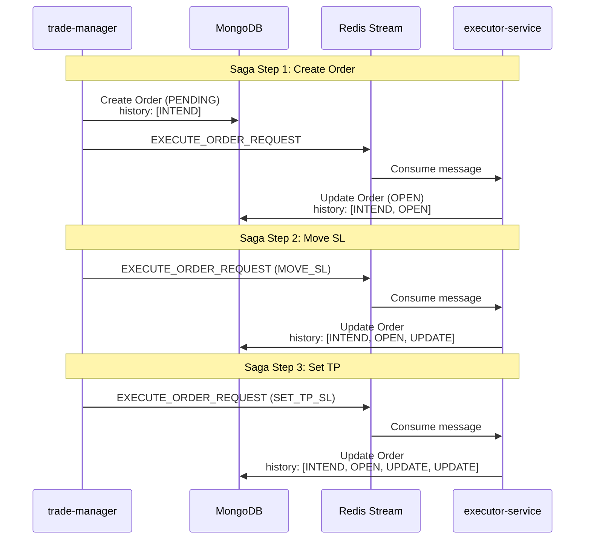

### Key Characteristics

#### 1. **Correlation ID**
Each saga is identified by a composite key:
```typescript
correlationId = (messageId, channelId, accountId)
```

- **messageId**: Links all steps to the original Telegram message
- **channelId**: Identifies the signal source
- **accountId**: Identifies the trading account

This enables:
- ✅ Tracking related operations across services
- ✅ Distributed tracing via `traceToken`
- ✅ Audit trail reconstruction

#### 2. **Sequential Saga Steps**
Messages within the same correlation ID are processed **sequentially**:

```
Step 1: LONG XAUUSD @ 2000    → Create Order (PENDING)
Step 2: MOVE_SL to 2005        → Update Order (SL moved)
Step 3: SET_TP_SL, TP: 2020    → Update Order (TP set)
```

**Why Sequential**:
- Each step depends on the previous step's completion
- Out-of-order execution would cause invalid operations
- Ensures data consistency within a saga

#### 3. **Event Sourcing Audit Trail**
Every state change is recorded in `Order.history[]`:

```typescript
{
  status: OrderHistoryStatus.OPEN,
  service: 'executor-service',
  ts: new Date(),
  traceToken: 'abc-123',
  messageId: 12345,
  channelId: 'gold-signals',
  command: CommandEnum.LONG,
  info: { entryPrice: 2000, lotSize: 0.5 }
}
```

**Benefits**:
- ✅ Full audit trail for compliance
- ✅ Can reconstruct order lifecycle
- ✅ Debug failures by replaying events
- ✅ Service attribution (who did what)

#### 4. **Compensating Actions**
When a Telegram message is edited, the system triggers compensating actions:

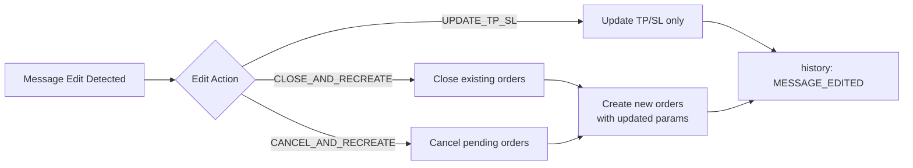

**Compensating Transaction Flow**:
1. Detect message edit
2. Determine edit action (close/cancel/update)
3. Execute compensating action
4. Record in `history[]` with `status: MESSAGE_EDITED`
5. Proceed with new saga if needed

#### 5. **Eventual Consistency**
The system uses **eventual consistency** across services:

- **Immediate Consistency**: Within MongoDB transactions (order creation + history)
- **Eventual Consistency**: Across services via Redis Streams
- **Convergence Time**: Typically < 1 second (depends on consumer lag)

**Trade-offs**:
- ✅ **Pros**: High availability, fault tolerance, horizontal scalability
- ⚠️ **Cons**: Temporary inconsistency between services

### Idempotency Considerations

**Current State**: Partially idempotent

| Scenario                | Idempotent? | Reason                                                 |
| ----------------------- | ----------- | ------------------------------------------------------ |
| Replay same `orderId`   | ✅ Yes       | Unique constraint on `orderId`                         |
| Replay same `messageId` | ⚠️ No        | Would create duplicate orders                          |
| Retry failed step       | ✅ Yes       | Sequential processing prevents duplicates within group |
| Concurrent requests     | ⚠️ Depends   | MongoDB transactions provide atomicity per service     |

**Future Enhancement**: Add deduplication check on `(messageId, channelId, accountId)` to achieve full idempotency.

### Failure Handling

**Saga Failure Scenarios**:

1. **Step Fails (Transient Error)**:
   - Retry with exponential backoff (max 3 retries)
   - If retries exhausted → Send to DLQ
   - Subsequent steps blocked until resolution

2. **Step Fails (Permanent Error)**:
   - ACK message to prevent infinite loop
   - Record in `history[]` with `status: ERROR`
   - ⚠️ **Current Gap**: No DLQ implementation (data loss risk)

3. **Message Expired (TTL)**:
   - ACK and skip message
   - Record in logs for monitoring
   - No saga execution

**Recommended**: Implement Dead Letter Queue (DLQ) for failed sagas to enable manual recovery.

---

## Event Flow

### Complete Message-to-Trade Flow

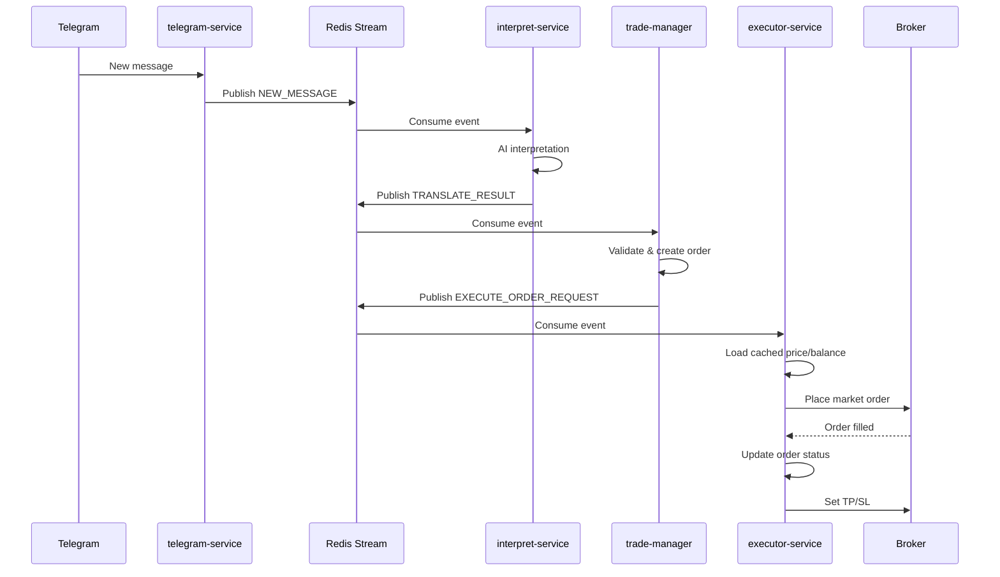

### Event Types

| Event Type                 | Topic                      | Producer          | Consumer          |
| -------------------------- | -------------------------- | ----------------- | ----------------- |
| `NEW_MESSAGE`              | `telegram-messages`        | telegram-service  | interpret-service |
| `TRANSLATE_MESSAGE_RESULT` | `translate-results`        | interpret-service | trade-manager     |
| `EXECUTE_ORDER_REQUEST`    | `order-execution-requests` | trade-manager     | executor-service  |

---

## Redis Stream Consumer Architecture

### Consumer Group Strategy

Each service uses **Redis Stream Consumer Groups** with PULL semantics for reliable message processing:

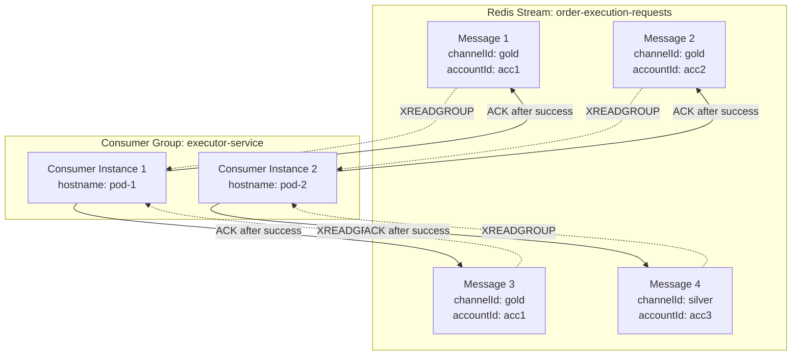

**Key Design Decisions**:

1. **Consumer Naming** (MVP: Single Instance):
   ```typescript
   // Current MVP implementation
   const getConsumerGroupName = () => config('APP_NAME'); // "executor-service"
   const getConsumerName = () => config('APP_NAME');      // "executor-service"
   
   // Future: Multiple instances (requires fix)
   const getConsumerName = () => process.env.HOSTNAME;    // "pod-1", "pod-2", etc.
   ```

2. **PULL Model Benefits**:
   - Services fetch messages at their own pace
   - No connection saturation from forced delivery
   - Natural backpressure via TTL expiration

3. **Message TTL**:
   - All messages have `exp` (expiration timestamp)
   - Expired messages are ACKed and skipped
   - Prevents unbounded queue growth

### Message Grouping Strategy

**Purpose**: Enable parallel processing while maintaining order within related messages.

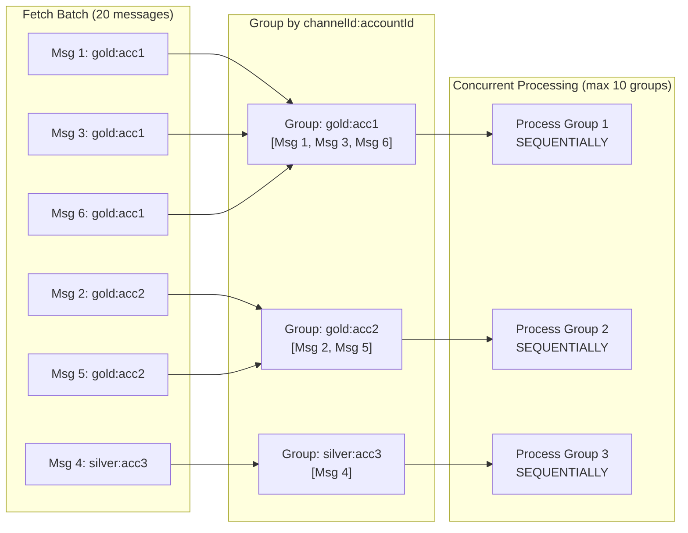

**Grouping Logic**:
```typescript
// Extract grouping key from message payload
const channelId = message.payload.channelId;
const accountId = message.payload.accountId; // Optional
const groupKey = accountId 
  ? `${channelId}:${accountId}`  // Group by channel + account
  : channelId;                    // Group by channel only
```

**Why Different Grouping Per Message Type**:

| Message Type               | Grouping Key          | Reason                                                        |
| -------------------------- | --------------------- | ------------------------------------------------------------- |
| `NEW_MESSAGE`              | `channelId` only      | One message per channel (no account context yet)              |
| `TRANSLATE_MESSAGE_RESULT` | `channelId` only      | **Cost optimization**: One AI call shared across all accounts |
| `EXECUTE_ORDER_REQUEST`    | `channelId:accountId` | **Parallel execution**: Each account processes independently  |

### Sequential Processing Within Groups

**Critical Requirement**: Messages within the same group MUST be processed sequentially to maintain order.

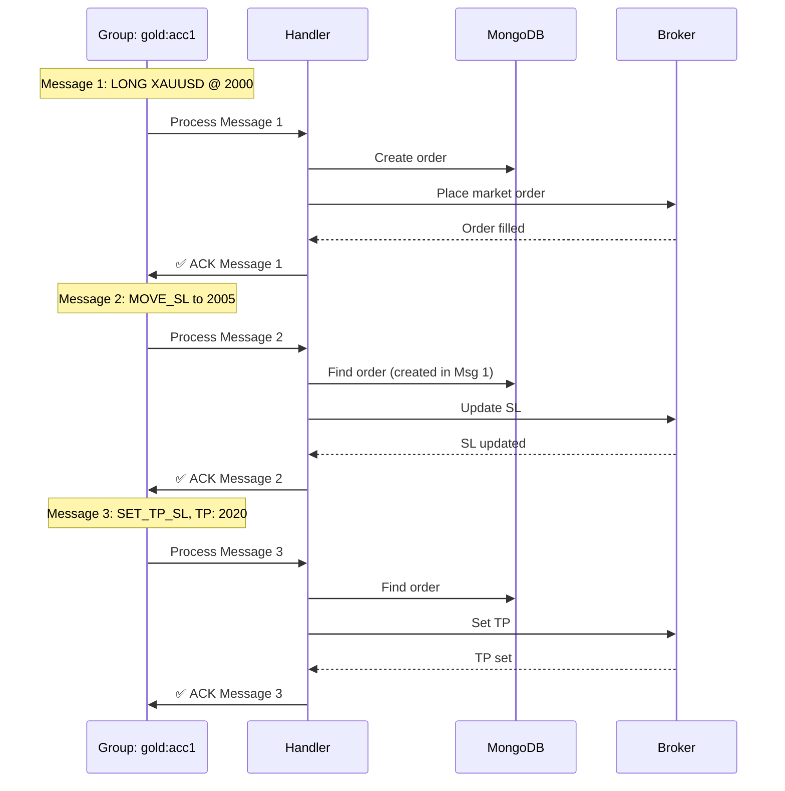

**What Happens on Failure**:
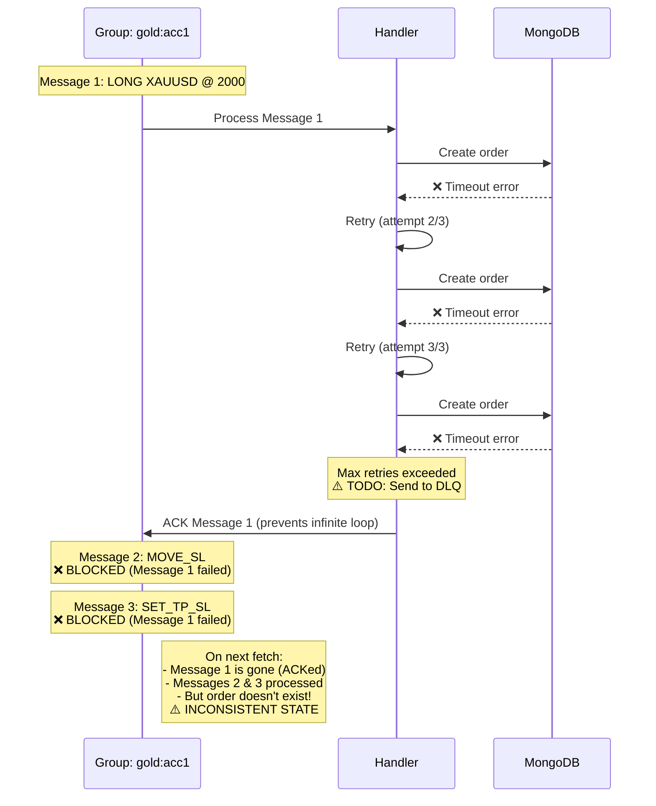

**Why Sequential Processing is Required**:
- Message 2 (MOVE_SL) depends on Message 1 (LONG) creating the order
- Message 3 (SET_TP_SL) depends on the order existing
- Processing out of order would cause invalid operations
- **Blocking on failure is intentional** to prevent inconsistent state

---

## AI Cost Optimization Strategy

### Single AI Translation Per Message

**Design Goal**: Minimize AI API costs while maintaining accuracy.

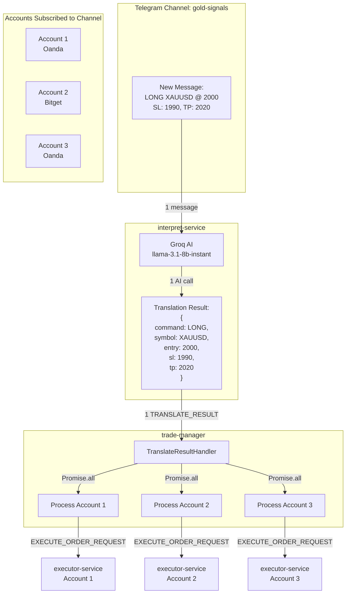

**Cost Comparison**:

| Approach                  | AI Calls | Cost (@ $0.10/1K tokens) | Latency     |
| ------------------------- | -------- | ------------------------ | ----------- |
| **Current (Shared)**      | 1 call   | $0.10                    | ~500ms      |
| Alternative (Per-Account) | 3 calls  | $0.30                    | ~1500ms     |
| **Savings**               | **-67%** | **-$0.20**               | **-1000ms** |

**Why This Works**:
- AI translation is **context-neutral** (no account-specific logic)
- Same signal applies to all accounts
- Account-specific logic (lot size, risk %) happens in `trade-manager`

**Trade-off**:
- ✅ **Pros**: Lower cost, faster processing, simpler architecture
- ⚠️ **Cons**: Cannot customize AI interpretation per account (acceptable for MVP)

### In-Memory Parallelism in trade-manager

**Current Implementation**:
```typescript
// apps/trade-manager/src/events/consumers/translate-result-handler.ts:151-154
const results = await Promise.all(
  activeAccounts.map((account) =>
    this.processAccountCommands(account, validCommands, context)
  )
);
```

**Flow**:
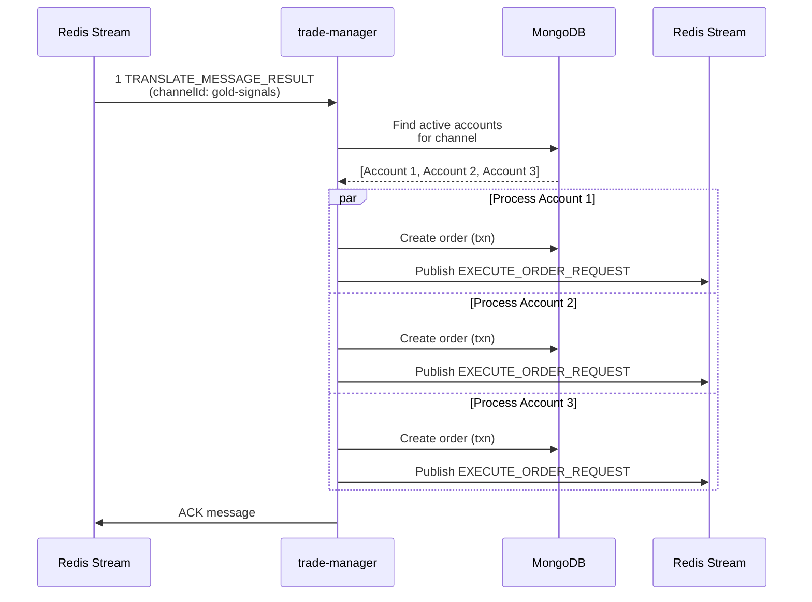

**Concurrency Control** (for 100+ accounts):
```typescript
import pLimit from 'p-limit';

// Limit concurrent MongoDB transactions
const limit = pLimit(50); // Max 50 concurrent operations

const results = await Promise.all(
  activeAccounts.map((account) =>
    limit(() => this.processAccountCommands(account, validCommands, context))
  )
);
```

---

## Performance Optimizations

### 1. **Redis Caching Layer**
**Problem**: Broker APIs are slow (200-500ms latency).  
**Solution**: Background jobs pre-fetch prices and balances into Redis.

**Cache Keys**:
- `price:{exchangeCode}:{symbol}` → `{ bid, ask, ts }`
- `balance:{exchangeCode}:{accountId}` → `{ balance, equity, margin, ts }`

**TTL Validation**:
- Price: Must be < 32s old
- Balance: Must be < 1800s old
- If stale, executor falls back to deferred SL calculation

### 2. **Lazy TP/SL Calculation**
For market orders without cached prices:
1. Place order immediately (no SL/TP)
2. Wait for broker to return fill price
3. Calculate and set SL/TP in second API call

### 3. **Batch Processing**
- `FetchPriceJob` groups symbols by exchange to minimize API calls
- `AutoUpdateOrderStatusJob` processes up to 50 orders per cycle

### 4. **Linked Order Synchronization**
When a new order with TP/SL is created:
- `AutoSyncTpSlLinkedOrderJob` broadcasts TP/SL to all linked orders
- Prevents manual syncing across DCA positions

---

## Error Handling & Observability

### Sentry Integration
All services capture exceptions with context:
```typescript
Sentry.captureException(error, {
  messageId,
  accountId,
  orderId,
  command,
  traceToken
});
```

### Audit Trail
Every critical action is logged in `history[]` arrays:
- **Telegram Messages**: AI interpretation, execution requests
- **Orders**: Placement, fills, cancellations, TP/SL updates

### Distributed Tracing
- `traceToken`: UUID propagated through all events
- `_sentryTrace` & `_sentryBaggage`: Sentry distributed tracing headers

---

## Deployment Architecture

### Development
```bash
# Local MongoDB with replica set
docker-compose up -d mongo redis

# Run services
pm2 start dist/apps/telegram-service/main.js
pm2 start dist/apps/interpret-service/main.js
pm2 start dist/apps/trade-manager/main.js
pm2 start dist/apps/executor-service/main.js
```

### Production Considerations
- **MongoDB**: Use Atlas with replica sets for transactions
- **Redis**: Use Upstash for managed Redis Streams
- **Scaling**: Each service can scale horizontally
  - **Fix consumer naming**: Use `process.env.HOSTNAME` instead of `APP_NAME`
  - Use consumer groups for parallel processing
  - Shard streams by `channelId` for high-volume channels (post-MVP)
- **Monitoring**: Sentry + New Relic for APM
- **Dead Letter Queue**: Implement DLQ for failed messages (critical for production)

### MVP Deployment (Single Instance)

**Current State**: One instance per service

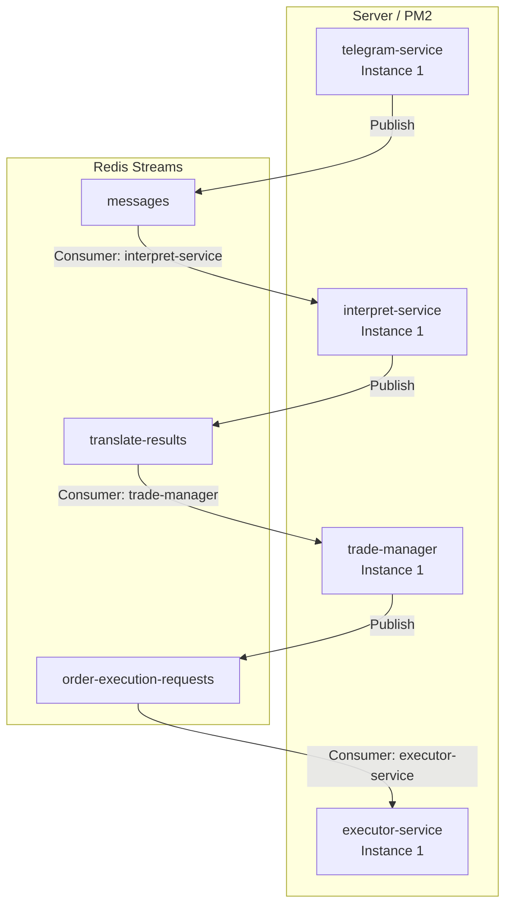

**Limitations**:
- ❌ No horizontal scaling (consumer name = APP_NAME)
- ❌ Single point of failure
- ✅ Simple deployment
- ✅ Sufficient for MVP (< 100 channels)

### Future: Horizontal Scaling

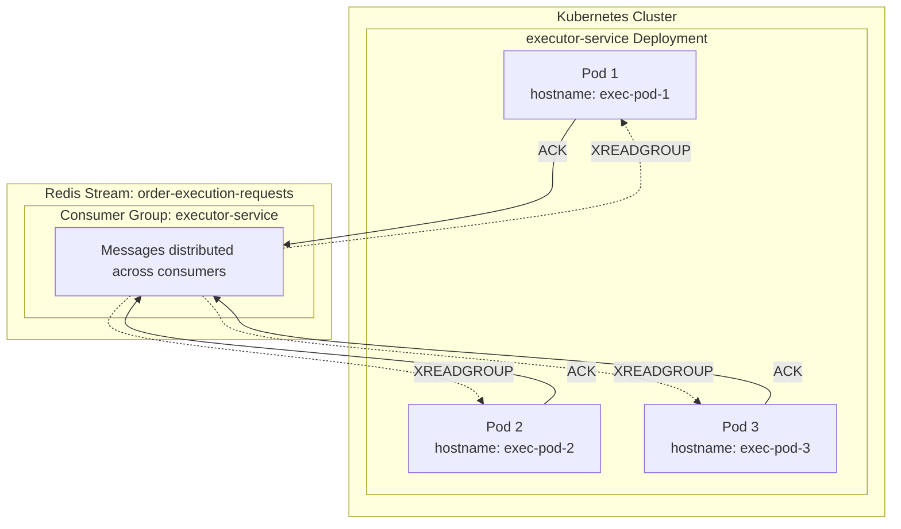

**Required Changes**:
```typescript
// Change consumer naming to support multiple instances
const getConsumerName = () => {
  return process.env.HOSTNAME ||        // K8s pod name
         process.env.CONTAINER_ID ||    // Docker container ID
         `${config('APP_NAME')}-${process.pid}`; // Fallback
};
```

---

## Technology Stack Summary

| Layer               | Technology                  |
| ------------------- | --------------------------- |
| **Language**        | TypeScript (Node.js 18+)    |
| **Monorepo**        | Nx                          |
| **Database**        | MongoDB (with replica sets) |
| **Messaging**       | Redis Streams (Upstash)     |
| **AI**              | Groq (llama-3.1-8b-instant) |
| **Telegram**        | MTCute                      |
| **Brokers**         | Oanda, Bitget               |
| **Observability**   | Sentry, New Relic           |
| **Notifications**   | Pushsafer                   |
| **Process Manager** | PM2                         |

---

## Security Considerations

1. **API Keys**: Stored in MongoDB `brokerConfig`, never in code
2. **Telegram Session**: Encrypted session string in `.env`
3. **Redis**: Use TLS for Upstash connections
4. **MongoDB**: Enable authentication and use connection strings with credentials
5. **Sentry**: Scrub sensitive data (API keys, balances) from error reports

---

## Future Enhancements

1. **Multi-Exchange Support**: Add more broker adapters (XM, Exness, Binance)
2. **Advanced Risk Management**: Portfolio-level risk limits
3. **Backtesting**: Replay historical messages for strategy validation
4. **Web Dashboard**: Real-time monitoring UI
5. **Webhooks**: External integrations (Discord, Slack)
