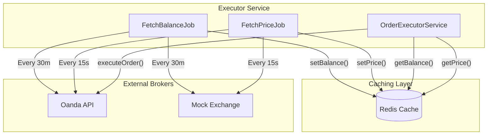

# Caching & Background Job Architecture

## Overview
The system utilizes a high-performance caching layer and a background job scheduler to ensure that order execution and lot-size calculations are performed using the most up-to-date account and market data without introducing latency during the critical trading path.

## Core Components

### 1. Redis Caching Layer
Redis is used as the central repository for transient data. Custom services in `libs/shared/utils` provide standardized access:
- **`PriceCacheService`**: Stores real-time bid/ask prices scoped by exchange code.
  - Key Format: `price:${exchangeCode}:${symbol}`
- **`BalanceCacheService`**: Stores account balance, equity, and margin information.
  - Key Format: `balance:${exchangeCode}:${accountId}`

### 2. Background Jobs (`executor-service`)
Jobs are managed by the `JobManager` and executed on a cron-based schedule:
- **`FetchBalanceJob`**:
  - **Frequency**: Every 30 minutes (recommended).
  - **Action**: Iterates through all active broker adapters, fetches current account snapshots, and updates the Redis balance cache.
- **`FetchPriceJob`**:
  - **Frequency**: Every 15-30 seconds.
  - **Action**: Fetches prices for a global list of trading symbols. It optimizes API usage by grouping symbols by exchange and performing batch requests.

### 3. Service Integration
- **`OrderExecutorService`**:
  - **Price Integration**: For market orders, the executor attempts to retrieve a cached price before execution. If a fresh price (TTL < 32s) exists, it is used as the entry price, allowing immediate Stop Loss (SL) and Take Profit (TP) calculation and placement.
  - **Balance Integration**: For lot-size calculations, the executor prefers the cached `Equity` (from `BalanceCacheService`) over the static database record, ensuring risk-based calculations account for floating P&L.

## Data Flow Diagram

## TTL Validation & Fallback Strategy
The system follows a **Lazy TTL Validation** pattern:
1. **Timestamping**: Every cached entry includes a `ts` (timestamp in Unix milliseconds) field inside the JSON payload.
2. **Read-time Validation**: When a service (e.g., `OrderExecutorService`) reads from the cache, it calculates the data age: `Age = CurrentTime - ts`.
3. **Thresholds**:
   - **Price**: Must be < 32 seconds old (2 cycles).
   - **Balance**: Must be < 1800 seconds (30 minutes) old.
4. **Fallback**: 
   - If price is stale, the executor proceeds without an entry price (using deferred SL logic).
   - If balance is stale, the system logs a warning and proceeds with the best available data or defaults.

## Observability & Error Handling
- **Informational History**: When a cached price is used for a market order, an `INFO` entry is added to the `Order.history`, documenting the exact price used.
- **Sentry Integration**: Job-level failures, such as broker API timeouts or Redis connection issues, are captured with full context (exchange, account ID, symbols).
- **Logging**: The system logs the source of balance data (Cache vs. Database) to assist in auditing lot-size discrepancies.
