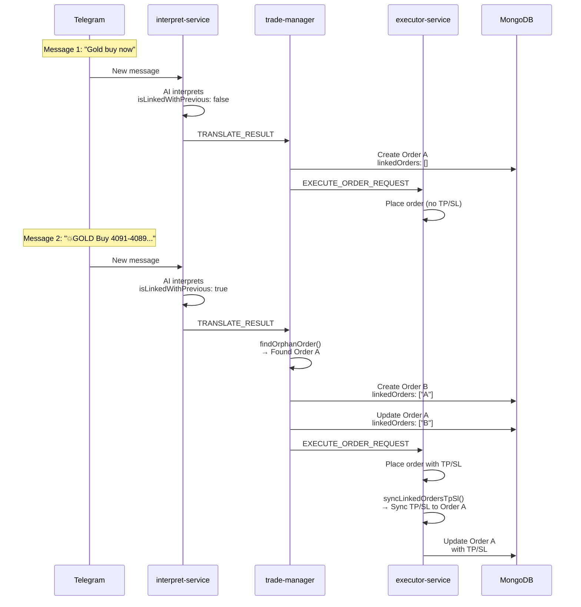

# Linked Orders: DCA Strategy Implementation

## Overview

**Linked Orders** is a feature designed to support **Dollar Cost Averaging (DCA)** trading strategies where multiple orders for the same position are created across sequential messages. This feature automatically links related orders together and synchronizes their Take Profit (TP) and Stop Loss (SL) values.

**Current Implementation**: Hang Moon channel (XAUUSD Gold trading)  
**Future Support**: Other channels with DCA strategies

---

## Problem Statement

### Trading Signal Pattern

Certain Telegram channels (like Hang Moon) send trading signals in **two separate messages**:

**Message 1** (First Signal - Entry Intent):
```
Gold buy now
```
- **Purpose**: Immediate entry signal
- **Content**: Only direction (buy/sell), no TP/SL
- **Action**: Create order without TP/SL

**Message 2** (Detailed Signal - TP/SL Details):
```
💥GOLD Buy 4091- 4089

✅TP  4094
✅TP  4111

💢SL  4086
```
- **Purpose**: Provide TP/SL for the previous entry
- **Content**: Entry zone, TP levels, SL price
- **Action**: Create linked order with TP/SL

### Challenge

Without linked orders:
- ❌ Two independent orders created
- ❌ No relationship between them
- ❌ Cannot sync TP/SL across related positions
- ❌ Manual management required

With linked orders:
- ✅ Orders automatically linked
- ✅ TP/SL synchronized across all linked orders
- ✅ Automatic DCA position management
- ✅ Unified risk management

---

## Architecture

### Data Model

**Order Entity** (`Order.linkedOrders`):
```typescript
interface Order {
  orderId: string;
  linkedOrders?: string[];  // Array of related order IDs
  // ... other fields
}
```

**Circular Relationship**:
```
Order A: { orderId: "A", linkedOrders: ["B"] }
Order B: { orderId: "B", linkedOrders: ["A"] }
```

Both orders reference each other, forming a **bidirectional link**.

### Message Flow



---

## Implementation Details

### 1. AI Detection (`interpret-service`)

**Prompt Configuration**: `apps/interpret-service/prompts/hang-moon/prompt.txt`

**Detection Rules**:

| Message Pattern            | Command | `isLinkedWithPrevious` |
| -------------------------- | ------- | ---------------------- |
| "Gold buy now"             | `LONG`  | `false` (orphan order) |
| "💥GOLD Buy 4091- 4089..."  | `LONG`  | `true` (linked order)  |
| "Gold sell now"            | `SHORT` | `false` (orphan order) |
| "💥GOLD Sell 4039- 4041..." | `SHORT` | `true` (linked order)  |

**Example AI Response** (Message 2):
```json
{
  "isCommand": true,
  "command": "LONG",
  "extraction": {
    "symbol": "XAUUSD",
    "side": "BUY",
    "isImmediate": true,
    "entry": null,
    "entryZone": [4091, 4089],
    "stopLoss": { "price": 4086 },
    "takeProfits": [
      { "price": 4094 },
      { "price": 4111 }
    ],
    "isLinkedWithPrevious": true  // ← Key flag
  }
}
```

### 2. Orphan Order Detection (`trade-manager`)

**Service**: `OrderService.findOrphanOrder()`  
**Location**: `apps/trade-manager/src/services/order.service.ts:170-199`

**Logic**:
```typescript
private async findOrphanOrder(
  accountId: string,
  channelId: string,
  session?: ClientSession
): Promise<Order | null> {
  // Find orders with empty or undefined linkedOrders
  const orphans = await this.orderRepository.findAll({
    accountId,
    channelId,
    status: { $in: [OrderStatus.PENDING, OrderStatus.OPEN] },
    $or: [
      { linkedOrders: { $exists: false } },
      { linkedOrders: { $size: 0 } },
    ],
  }, session);

  if (orphans.length === 0) return null;

  // Return most recent orphan (by createdAt)
  return orphans.sort(
    (a, b) => b.createdAt.getTime() - a.createdAt.getTime()
  )[0];
}
```

**Query Criteria**:
- Same `accountId` and `channelId`
- Status: `PENDING` or `OPEN` (active orders only)
- `linkedOrders` is empty or undefined
- Returns **most recent** orphan (latest `createdAt`)

### 3. Linking Process (`trade-manager`)

**Service**: `OrderService.createOrder()`  
**Location**: `apps/trade-manager/src/services/order.service.ts:66-164`

**Flow**:
```typescript
async createOrder(input: CreateOrderInput, session?: ClientSession) {
  const { isLinkedWithPrevious, orderId, accountId, channelId } = input;

  // Step 1: Find orphan order if this is a linked order
  let linkedOrderIds: string[] | undefined;
  if (isLinkedWithPrevious) {
    const orphanOrder = await this.findOrphanOrder(
      accountId,
      channelId,
      session
    );
    
    if (orphanOrder) {
      // Step 2: Create circular relationship
      linkedOrderIds = [orphanOrder.orderId];

      // Step 3: Update orphan order to link back using $push
      await this.orderRepository.updateOne(
        { _id: orphanOrder._id },
        { $push: { linkedOrders: orderId } },
        session
      );
    }
  }

  // Step 4: Create new order with linkedOrders
  const order: Order = {
    orderId,
    accountId,
    channelId,
    ...(linkedOrderIds && { linkedOrders: linkedOrderIds }),
    // ... other fields
  };

  await this.orderRepository.create(order, session);
  return { orderId, linkedOrderIds };
}
```

**Result**:
```
Before:
Order A: { orderId: "A", linkedOrders: [] }

After:
Order A: { orderId: "A", linkedOrders: ["B"] }
Order B: { orderId: "B", linkedOrders: ["A"] }
```

### 4. TP/SL Synchronization (`executor-service`)

**Service**: `OrderExecutorService.syncLinkedOrdersTpSl()`  
**Location**: `apps/executor-service/src/services/order-executor.service.ts:556-585`

**Trigger Points**:

1. **After opening a new order** (line 431-445):
   ```typescript
   // Check for linked orders to sync TP/SL
   const order = await this.orderRepository.findOne({ orderId });
   if (order && order.linkedOrders && order.linkedOrders.length > 0) {
     await this.syncLinkedOrdersTpSl(order, {
       traceToken,
       sl: order.sl?.slPrice ? { price: order.sl.slPrice } : undefined,
       tp: selectedTakeProfit?.[0]?.price 
         ? { price: selectedTakeProfit[0].price } 
         : undefined,
     });
   }
   ```

2. **After updating TP/SL** (line 537-549):
   ```typescript
   // Sync TP/SL to linked orders if not skipping
   if (!payload.meta?.skipLinkedOrderSync) {
     const order = await this.orderRepository.findOne({ orderId: payload.orderId });
     if (order) {
       await this.syncLinkedOrdersTpSl(order, {
         sl: payload.stopLoss,
         tp: payload.takeProfits?.[0],
         traceToken: payload.traceToken,
       });
     }
   }
   ```

**Sync Logic**:
```typescript
private async syncLinkedOrdersTpSl(
  sourceOrder: Order,
  options: { sl?: any; tp?: any; traceToken?: string } = {}
): Promise<void> {
  const { orderId, linkedOrders, accountId } = sourceOrder;

  if (!linkedOrders?.length) return;

  this.logger.info(
    { orderId, linkedCount: linkedOrders.length - 1 },
    'Broadcasting TP/SL to linked siblings'
  );

  // Iterate through all linked orders
  for (const targetOrderId of linkedOrders) {
    if (targetOrderId === orderId) continue; // Skip self

    // Trigger background job to update each linked order
    await this.triggerAutoSyncJob({
      accountId,
      targetOrderId,      // Update the sibling
      sourceOrderId: orderId,
      sl: options.sl,
      tp: options.tp,
      traceToken: options.traceToken,
    });
  }
}
```

### 5. Background Sync Job

**Job**: `AutoSyncTpSlLinkedOrderJob`  
**Location**: `apps/executor-service/src/jobs/auto-sync-tp-sl-linked-order.job.ts`

**Purpose**: Asynchronously update TP/SL on linked orders without blocking the main execution flow.

**Job Parameters**:
```typescript
interface AutoSyncTpSlParams {
  accountId: string;
  orderId: string;        // Target order to update
  sourceOrderId?: string; // Order that triggered the sync
  sl?: { price?: number };
  tp?: { price?: number };
}
```

**Execution Flow**:
```typescript
protected async onTick(params: AutoSyncTpSlParams, traceToken?: string) {
  const { accountId, orderId, sl, tp, sourceOrderId } = params;

  // 1. Fetch order from DB
  let order = await this.container.orderRepository.findOne({ orderId });
  if (!order || order.status !== OrderStatus.OPEN) return;

  // 2. Add history entry for audit trail
  await this.container.orderRepository.updateOne({ orderId }, {
    $push: {
      history: {
        status: OrderHistoryStatus.UPDATE,
        service: 'auto-sync-tp-sl-linked-order-job',
        command: CommandEnum.NONE,
        info: { sourceOrderId, sl, tp, reason: 'linked-order-sync' },
      },
    },
  });

  // 3. Build payload with special flags
  const payload: ExecuteOrderRequestPayload = {
    orderId,
    command: CommandEnum.SET_TP_SL,
    stopLoss: sl,
    takeProfits: tp ? [tp] : undefined,
    meta: {
      skipLinkedOrderSync: true,         // ← Prevent recursion
      skipBrokerPriceAdjustment: true,   // ← Don't re-adjust SL
    },
    // ... other fields
  };

  // 4. Call executor service to update TP/SL
  await this.container.orderExecutor.updateTakeProfitStopLoss(payload);
}
```

**Key Features**:
- ✅ **Prevents Recursion**: `skipLinkedOrderSync: true` stops infinite loops
- ✅ **Preserves Adjusted SL**: `skipBrokerPriceAdjustment: true` prevents re-applying broker adjustments
- ✅ **Audit Trail**: Records sync action in `Order.history`
- ✅ **Asynchronous**: Doesn't block main order execution

---

## TP Optimization for Linked Orders

### Overview

**TP Optimization** is a specialized feature for DCA (Dollar Cost Averaging) strategies that assigns **different Take Profit levels** to linked orders instead of synchronizing everyone to the same price.

### Problem Scenario

In standard linking, if Message 1 creates Order A and Message 2 creates Order B with TP 4150, both Order A and Order B will share the same TP (4150).

If the price moves toward TP but reverses at 4140 and hits the shared Stop Loss at 4086, **both orders result in a loss**.

### Solution

When `linkedOrderOptimiseTp` is enabled:
- **New Order (Order B)**: Receives the original selected TP (e.g., TP1 = 4150).
- **Orphan Order (Order A)**: Receives the **next less aggressive** TP (e.g., TP2 = 4111).

Because Order A's TP is closer to the current price, it is **more likely to hit** even if the price doesn't reach the final target. This secures at least one profitable trade even if the overall position eventually hits SL.

### Configuration

Enable it in the `Account` configuration:

```json
{
  "accountId": "acc-1",
  "configs": {
    "linkedOrderOptimiseTp": true,
    "takeProfitIndex": 0
  }
}
```

### Behavior Matrix

| `linkedOrderOptimiseTp` | TPs Available | New Order TP | Orphan Order TP | History Logged |
| :---------------------- | :------------ | :----------- | :-------------- | :------------- |
| `false`                 | Any           | TP1          | TP1             | No             |
| `true`                  | 1             | TP1          | TP1 (Fallback)  | No             |
| `true`                  | 2+            | TP1          | TP2             | Yes (INFO)     |

### History Logging

When optimization is applied, an `INFO` entry is added to the order history:

```json
{
  "status": "info",
  "service": "executor-service",
  "message": "TP optimization applied for linked orders",
  "info": {
    "currentOrderTP": 4150,
    "linkedOrderTP": 4111
  }
}
```

---

## Complete Example

### Scenario: Hang Moon DCA Strategy

**Timeline**:

**10:00:00** - Message 1 arrives:
```
Gold buy now
```

**AI Interpretation**:
```json
{
  "command": "LONG",
  "extraction": {
    "symbol": "XAUUSD",
    "side": "BUY",
    "stopLoss": null,
    "takeProfits": [],
    "isLinkedWithPrevious": false  // ← Orphan order
  }
}
```

**trade-manager**:
```typescript
// Create Order A (orphan)
{
  orderId: "ORDER-A",
  accountId: "acc-1",
  channelId: "hang-moon",
  symbol: "XAUUSD",
  side: "LONG",
  linkedOrders: [],  // ← Empty (orphan)
  status: "PENDING"
}
```

**executor-service**:
- Places market order
- No TP/SL set (none provided)
- Order A status → `OPEN`

---

**10:00:05** - Message 2 arrives:
```
💥GOLD Buy 4091- 4089

✅TP  4094
✅TP  4111

💢SL  4086
```

**AI Interpretation**:
```json
{
  "command": "LONG",
  "extraction": {
    "symbol": "XAUUSD",
    "side": "BUY",
    "entryZone": [4091, 4089],
    "stopLoss": { "price": 4086 },
    "takeProfits": [
      { "price": 4094 },
      { "price": 4111 }
    ],
    "isLinkedWithPrevious": true  // ← Linked order
  }
}
```

**trade-manager**:
```typescript
// Step 1: Find orphan order
const orphan = await findOrphanOrder("acc-1", "hang-moon");
// → Returns Order A

// Step 2: Create Order B with link
{
  orderId: "ORDER-B",
  accountId: "acc-1",
  channelId: "hang-moon",
  symbol: "XAUUSD",
  side: "LONG",
  linkedOrders: ["ORDER-A"],  // ← Links to Order A
  status: "PENDING"
}

// Step 3: Update Order A
{
  orderId: "ORDER-A",
  linkedOrders: ["ORDER-B"]  // ← Now linked to Order B
}
```

**executor-service**:
```typescript
// Step 1: Place Order B with TP/SL
await placeOrder({
  symbol: "XAUUSD",
  side: "BUY",
  stopLoss: { price: 4086 },
  takeProfits: [{ price: 4094 }, { price: 4111 }]
});

// Step 2: Sync TP/SL to Order A
await syncLinkedOrdersTpSl(orderB, {
  sl: { price: 4086 },
  tp: { price: 4094 }
});

// Step 3: Trigger background job
await triggerAutoSyncJob({
  accountId: "acc-1",
  targetOrderId: "ORDER-A",  // ← Update Order A
  sourceOrderId: "ORDER-B",
  sl: { price: 4086 },
  tp: { price: 4094 }
});
```

**Background Job**:
```typescript
// Update Order A with TP/SL from Order B
await updateTakeProfitStopLoss({
  orderId: "ORDER-A",
  stopLoss: { price: 4086 },
  takeProfits: [{ price: 4094 }],
  meta: {
    skipLinkedOrderSync: true,  // ← Don't sync back to Order B
    skipBrokerPriceAdjustment: true
  }
});
```

**Final State**:
```
Order A:
- orderId: "ORDER-A"
- linkedOrders: ["ORDER-B"]
- sl: { slPrice: 4086, slOrderId: "SL-123" }
- tp: { tp1Price: 4094, tp1OrderId: "TP-456" }
- status: "OPEN"

Order B:
- orderId: "ORDER-B"
- linkedOrders: ["ORDER-A"]
- sl: { slPrice: 4086, slOrderId: "SL-789" }
- tp: { tp1Price: 4094, tp1OrderId: "TP-012" }
- status: "OPEN"
```

**Result**: Both orders now have synchronized TP/SL values! ✅

---

## Edge Cases & Limitations

### 1. Multiple Orphan Orders

**Scenario**: Two "Gold buy now" messages sent before detailed signal

**Behavior**: `findOrphanOrder()` returns **most recent** orphan (by `createdAt`)

**Result**: Only the latest orphan gets linked

**Recommendation**: Channels should follow consistent messaging patterns

### 2. No Orphan Found

**Scenario**: Detailed signal arrives but no orphan order exists

**Behavior**: Order created without links (`linkedOrders: []`)

**Result**: Standalone order (no sync)

### 3. Recursion Prevention

**Problem**: Order A syncs to Order B, which tries to sync back to Order A

**Solution**: `meta.skipLinkedOrderSync: true` flag prevents recursion

**Implementation**:
```typescript
if (!payload.meta?.skipLinkedOrderSync) {
  await this.syncLinkedOrdersTpSl(order, { ... });
}
```

### 4. Broker Price Adjustment

**Problem**: SL already adjusted for broker requirements, re-adjusting would be wrong

**Solution**: `meta.skipBrokerPriceAdjustment: true` preserves original adjusted value

**Use Case**: When syncing already-adjusted SL from Order B to Order A

### 5. Order Status Filtering

**Behavior**: Only `PENDING` and `OPEN` orders are considered orphans

**Reason**: `CLOSED` or `CANCELED` orders shouldn't be linked to new orders

---

## Future Enhancements

### 1. Multi-Level Linking

**Current**: 2-order chains (A ↔ B)

**Future**: N-order chains (A ↔ B ↔ C ↔ D)

**Use Case**: Multiple DCA entries across 3+ messages

### 2. Partial TP/SL Sync

**Current**: Syncs all TP/SL values

**Future**: Selective sync (e.g., only SL, or only TP1)

### 3. Link Expiration

**Current**: Links persist indefinitely

**Future**: Auto-unlink after time period or when all orders closed

### 4. Cross-Channel Linking

**Current**: Only links orders within same channel

**Future**: Link orders across channels (advanced use case)

---

## Monitoring & Debugging

### Key Metrics

1. **Orphan Order Rate**: % of orders with empty `linkedOrders`
2. **Sync Success Rate**: % of successful TP/SL sync jobs
3. **Sync Latency**: Time between order creation and TP/SL sync completion

### Audit Trail

Every linked order action is recorded in `Order.history`:

```typescript
{
  status: OrderHistoryStatus.UPDATE,
  service: 'auto-sync-tp-sl-linked-order-job',
  command: CommandEnum.NONE,
  info: {
    sourceOrderId: "ORDER-B",
    reason: "linked-order-sync",
    sl: { price: 4086 },
    tp: { price: 4094 }
  }
}
```

### Debugging Queries

**Find all linked order pairs**:
```javascript
db.orders.find({
  linkedOrders: { $exists: true, $ne: [] }
})
```

**Find orphan orders**:
```javascript
db.orders.find({
  status: { $in: ["pending", "open"] },
  $or: [
    { linkedOrders: { $exists: false } },
    { linkedOrders: { $size: 0 } }
  ]
})
```

**Find sync history**:
```javascript
db.orders.find({
  "history.service": "auto-sync-tp-sl-linked-order-job"
})
```

---

## Summary

Linked Orders enable **automatic DCA position management** by:

1. ✅ **AI Detection**: Identifies linked vs orphan orders via `isLinkedWithPrevious`
2. ✅ **Automatic Linking**: Finds most recent orphan and creates circular relationship
3. ✅ **TP/SL Synchronization**: Broadcasts TP/SL changes across all linked orders
4. ✅ **Background Processing**: Async jobs prevent blocking main execution
5. ✅ **Recursion Prevention**: Smart flags prevent infinite sync loops
6. ✅ **Audit Trail**: Complete history of all linking and sync actions

**Current Support**: Hang Moon channel (XAUUSD)  
**Future**: Extensible to any channel with DCA strategies
