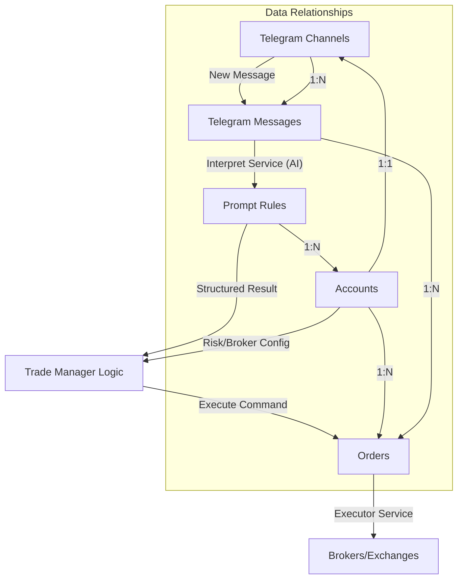

# Telegram Auto-Trading Bot: Technical Setup Guide

This guide is designed for technical users who want to set up and get started with the Telegram Auto-Trading system. It assumes you are comfortable with Node.js/TypeScript environments, MongoDB, and basic server orchestration.

---

## 🏗️ System Overview & Core Logic

The system follows an event-driven architecture using Upstash Redis Streams for inter-service communication.

### Core Relationship Diagram



### Key Domain Objects
- **`telegram-channels`**: Configures which channels to monitor. Each channel has a unique `channelCode`.
- **`accounts`**: Your trading accounts (Oanda, Bitget, etc.). Each account is linked to a `telegramChannelCode` and a `promptId`.
- **`prompt-rules`**: Contains the System Prompt used by the `interpret-service` to parse human language into trading commands.
- **`orders`**: Tracks the lifecycle of a trade (Pending → Open → Closed). Linked back to the `telegram-message` that triggered it.

---

## 🚀 Quick Start Setup

### 1. Build & Environment
The project uses Nx Monorepo.

```bash
# Install dependencies
npm install

# Build the entire workspace
npx nx run-many -t build

# Or build specific services
npx nx build interpret-service
npx nx build trade-manager
npx nx build executor-service
```

### 2. Infrastructure Setup
- **MongoDB**: Primary database for all services. Requires a Replica Set for transactions (use `rs0` for local dev).
- **Redis**: Used for:
    - **Upstash Redis Stream**: Broker for events.
    - **Caching**: Storing real-time prices and account balances for performance.

### 3. External Service Configuration

Each service requires a `.env` file based on the `.env.sample` in its directory.

#### **Telegram Session (telegram-service)**
You need a valid Telegram API ID and Hash from [my.telegram.org](https://my.telegram.org).
To generate the `TELEGRAM_SESSION` string:
1. Go to `testing/telegram-fetcher`.
2. Run `npm start`.
3. Follow the interactive prompts; it will generate and display a session string upon successful login.

#### **AI Model (interpret-service)**
We recommend **Groq** for high-speed signal interpretation.
- `AI_PROVIDER=groq`
- `AI_GROQ_API_KEY=your-key`
- `AI_GROQ_MODEL=llama-3.1-8b-instant`

#### **Notifications (All Services)**
We use **Pushsafer** for real-time alerts on order execution or critical errors.
- `PUSHSAFER_API_KEY=your-key`

#### **Observability**
- **Sentry**: Configure `SENTRY_DSN` in all services to capture runtime exceptions.

### 4. Database Configuration (Sample Collections)

#### **Accounts (`accounts`)**
The `brokerConfig` varies per exchange.

**Oanda (Forex/Gold):**
```json
{
  "accountId": "oanda_acc_01",
  "brokerConfig": {
    "exchangeCode": "oanda",
    "apiKey": "YOUR_API_KEY",
    "isSandbox": true,
    "accountId": "101-011-XXXX-001",
    "maxShareVirtualAccounts": 10 // Use 10 if your account has $100k but you want to risk only $10k
  }
}
```

**Bitget (Crypto):**
```json
{
  "accountId": "bitget_acc_01",
  "brokerConfig": {
    "exchangeCode": "bitget",
    "apiKey": "YOUR_API_KEY",
    "apiSecret": "YOUR_SECRET",
    "apiPassphrase": "YOUR_PASSPHRASE",
    "isSandbox": false
  }
}
```

**Common Configs:**
```json
"configs": {
  "closeOppositePosition": true,
  "defaultMaxRiskPercentage": 1, // 1% risk per trade
  "maxOpenPositions": 5,
  "stopLossAdjustPricePercentage": 0.25, // Buffer for broker price differences
  "operationHours": {
    "timezone": "America/New_York",
    "schedule": "Sun-Fri: 18:05 - 16:59"
  }
}
```

#### **Prompt Rules (`prompt-rules`)**
Copy the content of the latest prompt from `apps/interpret-service/prompts/<channel>/prompt.txt`.
```json
{
  "promptId": "gold-signal-v1",
  "name": "Gold Signal Parser",
  "systemPrompt": "...content from prompt.txt..."
}
```

---

## ⚡ Performance Optimization Techniques

1. **Price & Balance Caching**:
   - `executor-service` runs background jobs (`fetch-price-job`, `fetch-balance-job`) to sync data into Redis every few seconds/minutes.
   - When an order arrives, the system uses cached values to calculate lot sizes and SL/TP immediately, avoiding slow broker API calls during the execution path.
2. **Event-Driven Execution**: Services communicate via lightweight Redis streams, allowing `trade-manager` to handle complex logic while `executor-service` focuses on fast I/O with brokers.
3. **Lazy TTL Validation**: Cached data is timestamped by the sync jobs. When an order is executed, the system checks if the cached price is < 32s old. If stale, it falls back to deferred SL calculation.

---

## 🛠️ Extending the Application

### 1. Fetching Historical Messages
To test your prompts or backfill data, use the telegram-fetcher utility:
```bash
cd testing/telegram-fetcher
npm run start -- --limit 50 --channel "-100..."
```

### 2. Improving Signal Interpretation
If the AI is misinterpreting signals:
1. Go to `apps/interpret-service/prompts/<channel-folder>/`.
2. Update `prompt.txt` with better rules or more examples.
3. Update the `prompt-rules` collection in MongoDB with the new prompt text.
4. The service will automatically pick up the new prompt for the next message.

### 3. Running with PM2
```bash
# Start all core services
pm2 start dist/apps/interpret-service/main.js --name interpret
pm2 start dist/apps/trade-manager/main.js --name trade-manager
pm2 start dist/apps/executor-service/main.js --name executor
pm2 start dist/apps/telegram-service/main.js --name telegram
```
