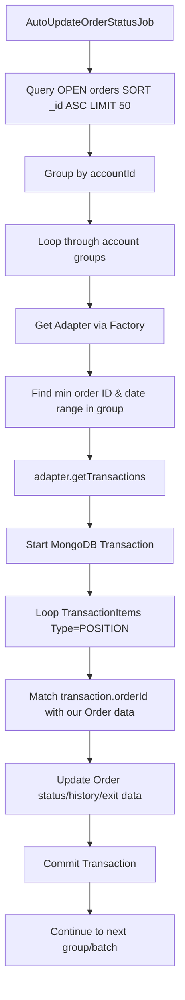

# Design: Auto Update Order Status Job

## Data Flow

## Implementation Details

### 1. Database Query & Indexing
- The job queries `orders` where `status = "open"`.
- It sorts by `_id` ascending.
- **Verification**: `libs/dal/src/infra/db.ts` already has a compound index `{ accountId: 1, status: 1 }` and a single index `{ status: 1 }`. These are sufficient for the query.
- Sorting by `_id` is naturally supported as it's the primary key.

### 2. Transaction Handling (Oanda)
- `OandaAdapter.getTransactions` uses `sinceAsync(id)`.
- The job needs to find the minimum `entryOrderId`, `slOrderId`, or `tp1OrderId` in the group to use as `fromId` if we want to be precise, or use the earliest `createdAt` as a time filter if the adapter supports it.
- Since Oanda requires an ID for `since`, we will:
    - Collect all potential broker-side IDs in the group: `entry.entryOrderId`, `sl.slOrderId`, `tp.tp1OrderId`.
    - Find the minimum ID (string comparison might work if IDs are sequential, or we just use the one associated with the oldest `_id`).
    - More reliably: use the `entryOrderId` of the oldest order in the group.

### 3. State Mapping
- If `TransactionItem.status === CLOSED`:
    - Update `Order.status = CLOSED`.
    - Update `Order.closedAt = TransactionItem.closeTime`.
    - Update `Order.exit.actualExitPrice = TransactionItem.closedPrice`.
    - Update `Order.pnl.pnl = TransactionItem.pnl`.
    - Add `OrderHistory` with `status = OrderHistoryStatus.CLOSED` (or `TAKE_PROFIT`/`STOP_LOSS` if `closeReason` matches).
    - **History Info Message**: The `info.message` in history should be `Auto closed due to ${TransactionItem.closeReason}`.

### 4. Batched Processing
- Configurable Batch Limit: `meta.batchLimit || 50`.
- Frequency: Every 1 min at 30th second (e.g., `30 * * * * *`).

### 5. MongoDB Transactions
- Each account group update will be wrapped in a MongoDB transaction to ensure atomicity of multiple order updates.

## Error Handling
- Use `try-catch` around the entire job loop.
- Use `try-catch` inside the account group loop to ensure one account failure doesn't block others.
- Capture exceptions with Sentry.
